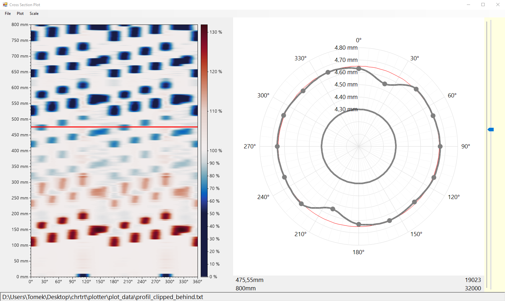

# Cross Section Plot

Simple Windows Forms application which plots cross section of a hollow cylinder. Each cylinder defines inner diameter and outer diameter. Plot data is a single text file which contains inner diameter, outer diameter, row spacing and a series of rows where each row contains radiuses of cross section at a certain height of the cylinder. Examples are contained in [plot_data](plot_data).

## Prerequisites

Make sure you have installed all of the following:
* .NET Framework 4.7.2
* Visual Studio 2022 - optional, only needed if you wish to build the solution yourself.

## Build

This repository contains a Visual Studio project. Simply ppen [WindowsFormsApp1.sln](WindowsFormsApp1.sln) in Visual Studio and build the solution. This repository also contains an already built solution.

## Run

Either run directly after building in Visual Studio, or run the built solution [here](WindowsFormsApp1/bin/Release/WindowsFormsApp1.exe).

## Usage

First select the text file with plot data `File -> Choose` (or with `Ctrl + O`). After selecting the text file, the path should show up at the bottom. Then `Plot -> Plot Draw` (or `Ctrl + P`). Change the height at which the cylinder's cross section is shown using the slider on the right (or using scroll wheel while the mouse cursor is on the right plot). Heatmap on the left shows the surface of an entire cylinder. Blue color means wear on the cylinder surface, which means that measured radiuses are less than half of outer diameter (which is considered healthy). Red color means the opposite: bumps on the cylinder. Use `Scale` options on the top to change from absolute measurements to relative.

## Preview

